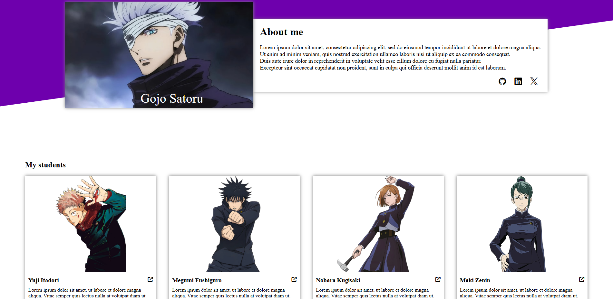
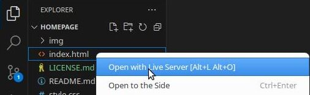

# Homepage

## Description

This website is built by following the Responsive Design principles.

By following the natural flow of HTML and enforcing Media Queries, this website can be opened on all major screen types (mobile, tablet, or desktop).

## Features

- Responsive design
- Flexible grid

## Installation

1. **Fork the Repository**

    - Follow the documentation on GitHub to [fork this repository](https://docs.github.com/en/pull-requests/collaborating-with-pull-requests/working-with-forks/fork-a-repo).  

    - You should also have a local clone of the forked repository after following the tutorial.

2. **Move to the cloned directory**

    ``cd homepage``

3. **Launch Preview**

    Right click on ``index.html``, then select **Open with Live Server**

    

## Contribute

- Issue Tracker: github.com/jayyzzeezzy/homepage/issues
- Source Code: github.com/jayyzzeezzy/homepage.git

## Support

Let me know if you encounter any issues.  
Email me at: <jam9es@gmail.com>

## License

The project is licensed under the [MIT license](LICENSE.md).
